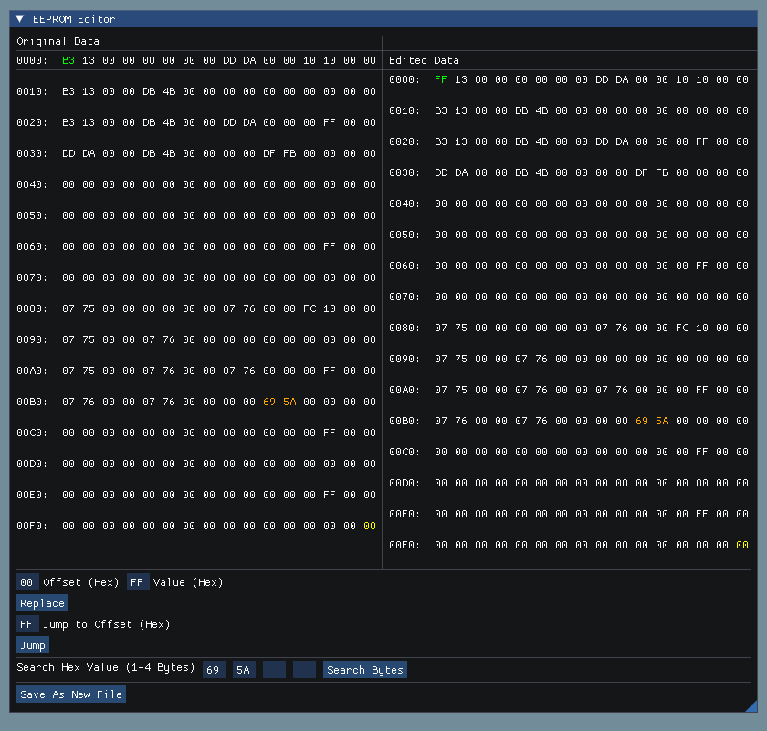

# EEPROM_E
EEPROM_Editor


### Dependencies

```
sudo apt install make pkg-config g++ libglfw3-dev
```


### Install


```

https://github.com/Tpj-root/EEPROM_E.git
git submodule update --init --recursive
make
./Project.exe
```





**Notes:**

```
https://pthom.github.io/imgui_manual_online/manual/imgui_manual.html
```

